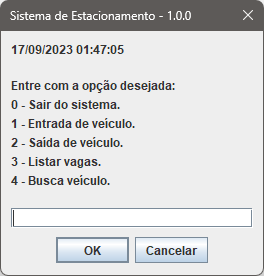
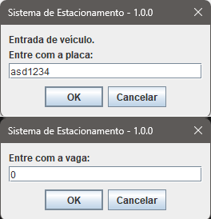
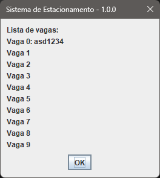
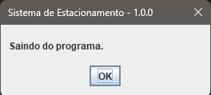

# Projeto Estacionamento
Projeto para simular o funcionamento de um estacionamento.
#

## Requisitos Funcionais
1. Atribuir carro a uma vaga.
2. Liberar vaga na saída do carro do estacionamento.
3. Listar vagas do estacionamento com a respectiva situação.
#

## Resisitos não funcionais
Com o desenvolvimento da aplicação serão listados
#

### Tela principal

### Tela de entrada de veículo

### Tela de lista de vagas

### Tela de saída do sistema

#

## Estrutura do Projeto
O projeto é composto por:
- Classe principal `Estacionamento` que controla a lógica do estacionamento.
- Arrays para representar as vagas de estacionamento.
- Métodos para entrada, saída e listagem de veículos.
#

## Tecnologias Utilizadas
- [Java](https://www.java.com/): Linguagem de programação principal.
- [Swing](https://docs.oracle.com/javase/8/docs/api/javax/swing/package-summary.html): Biblioteca Java para criar interfaces gráficas.
- [Eclipse](https://www.eclipse.org/): Ambiente de desenvolvimento integrado (IDE) utilizado para escrever e compilar o código.
- [Git](https://git-scm.com/): Sistema de controle de versão para gerenciar o código-fonte.
- [GitHub](https://github.com/): Plataforma de hospedagem de código-fonte.

#
